# 🍔 FoodieFave

A full-stack **Food Ordering Website** built using the **MERN stack (MongoDB, Express.js, React, Node.js)** with **Tailwind CSS** for styling. This web application supports **user interactions for placing orders**, **admin functionalities to manage food items**, and a **dummy payment system** for simulating transactions. The website is fully responsive.

---

## ⚙️ Tech Stack

- **Frontend**: React.js, JavaScript, Tailwind CSS
- **Backend**: Node.js, Express.js
- **Database**: MongoDB
- **Payment**: Dummy Payment Gateway (simulation only)

---

## ✨ Features

### ✅ User Features
- Browse available food items
- Add items to the cart
- View total price and order summary
- Place orders with delivery information
- Simulated payment process (dummy route)
- Order success confirmation

### 🛠️ Admin Features
- Add new food items to the database
- View full list of available foods
- Delete/remove food items from the list

---

## 🧾 Folder Structure

.
├── backend
│ ├── controllers
│ ├── middleware
│ ├── models
│ ├── routes
│ └── server.js
├── frontend
│ ├── src
│ │ ├── assets
│ │ ├── components
│ │ ├── pages
│ │ └── context
│ └── tailwind.config.js
├── admin
│ ├── src
│ │ ├── assets
│ │ ├── components
│ │ ├── pages
│ └── tailwind.config.js

---

## 🚀 Getting Started

### 1. Clone the Repository

git clone https://github.com/sadia-54/FoodieFave.git

---

## Install Dependencies

### cd server
npm install

### cd client
npm install

### cd admin
npm install

---

## Run the app

### cd server
npm run server

### cd client
npm run dev

### cd admin
npm run dev

---

### Demo Videos on this link 
[Full_Website_Video](https://drive.google.com/drive/folders/1bggR71Z93QK-gdorvEhEGJ5KGcKJtNGf?usp=drive_link)

### 🖼️ Screenshots

#### Home Page
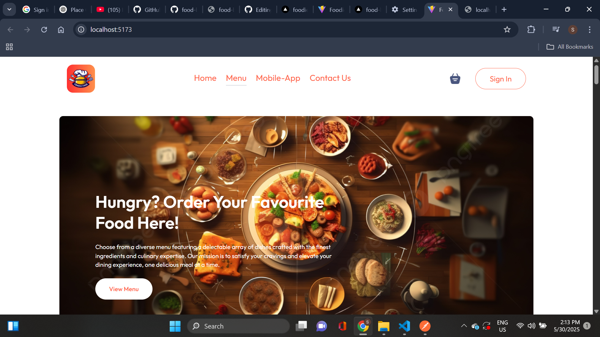
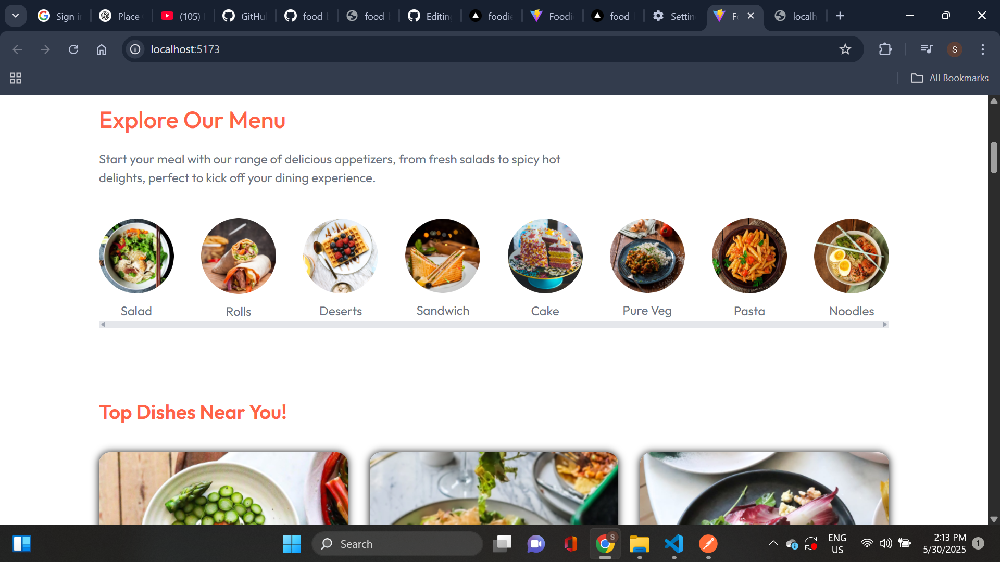
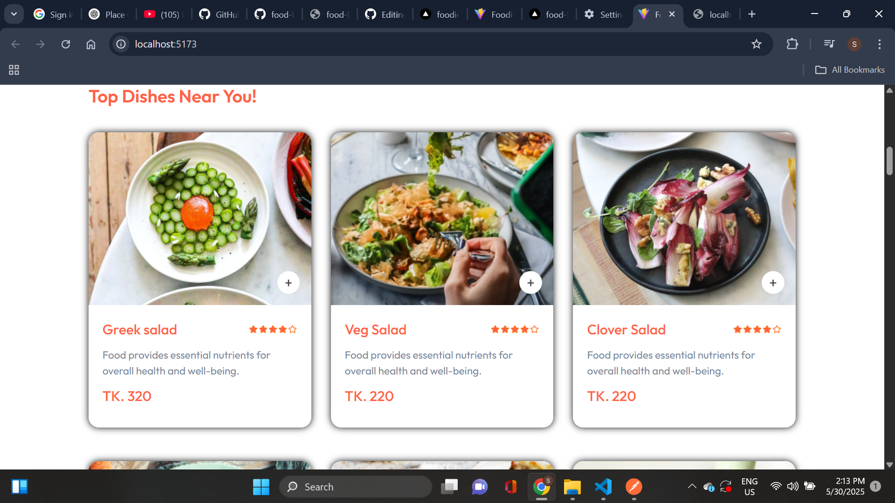
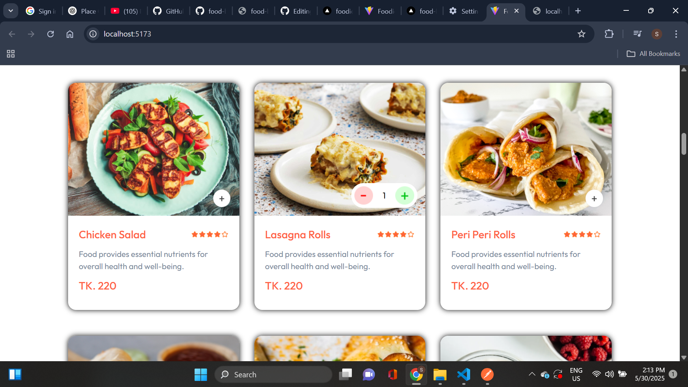
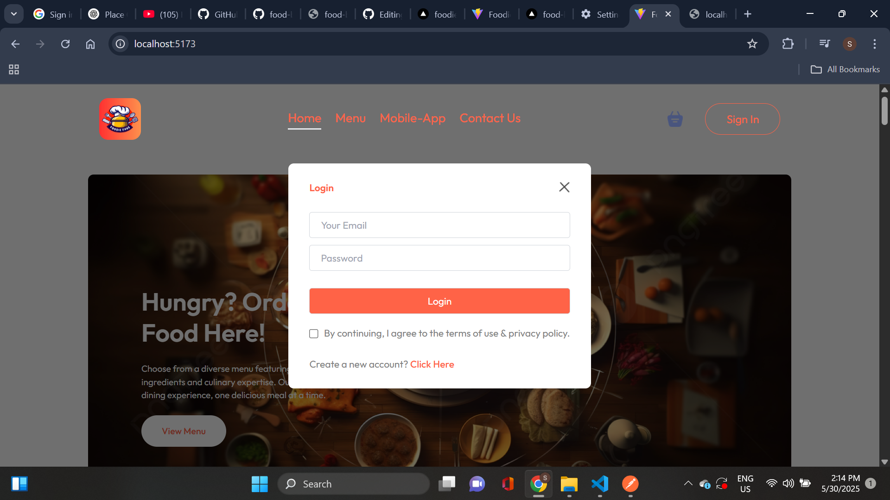
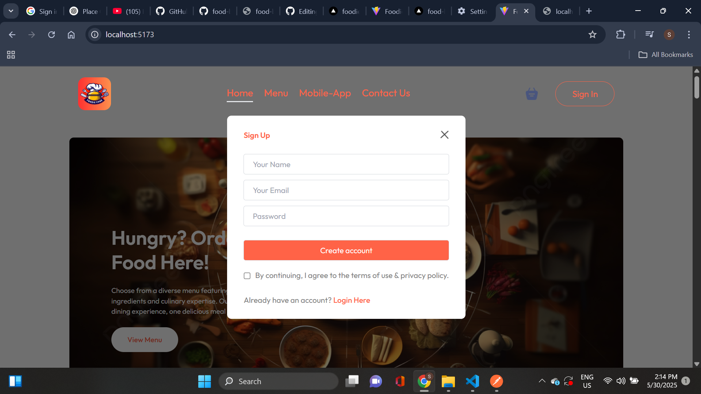
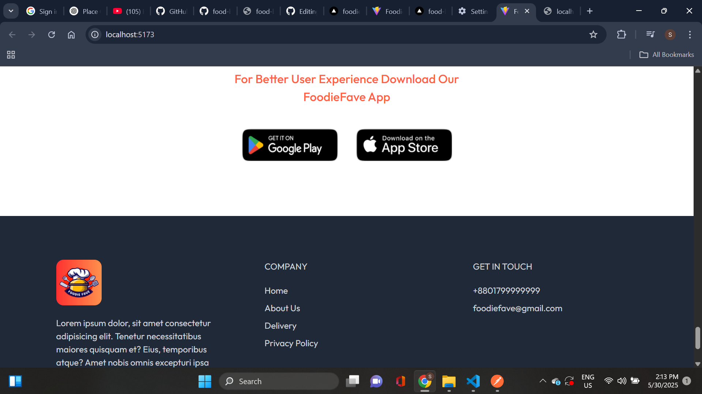
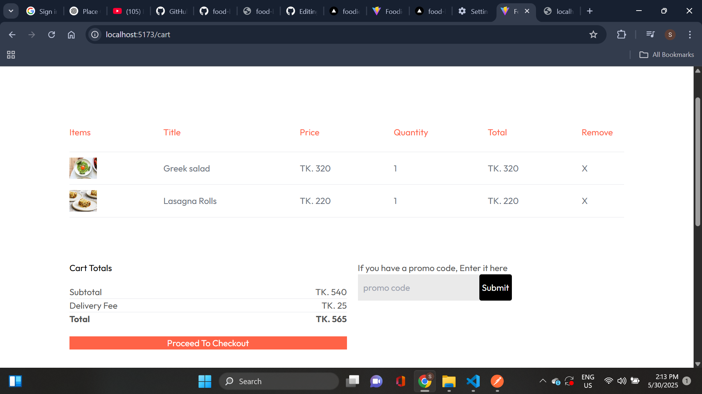
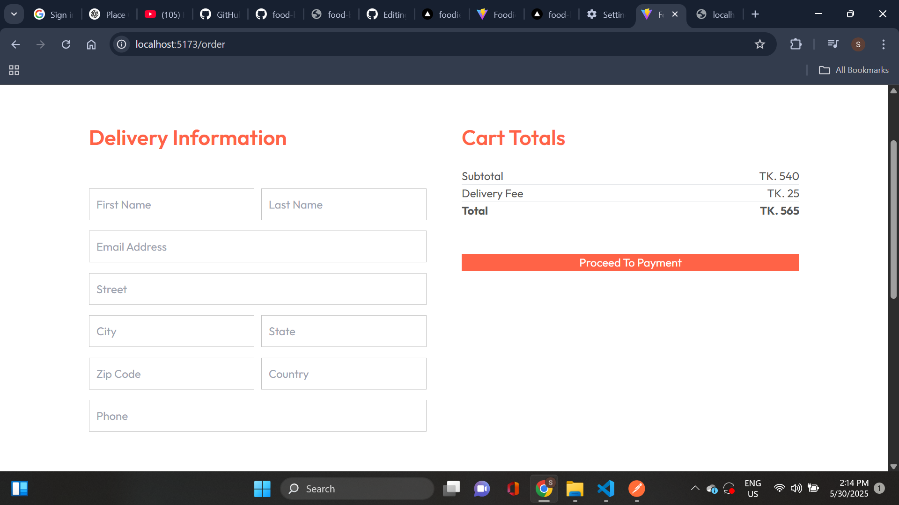
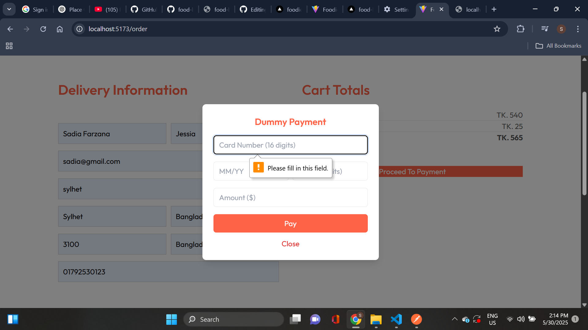

#### Admin Dashboard
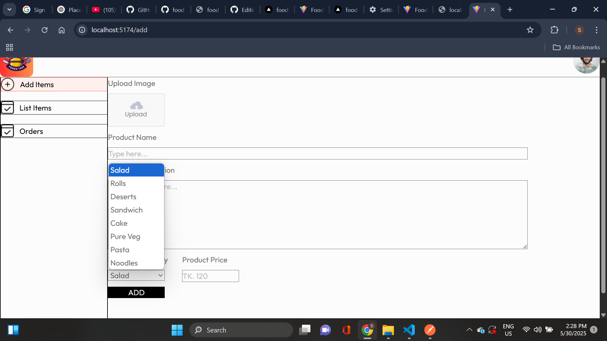
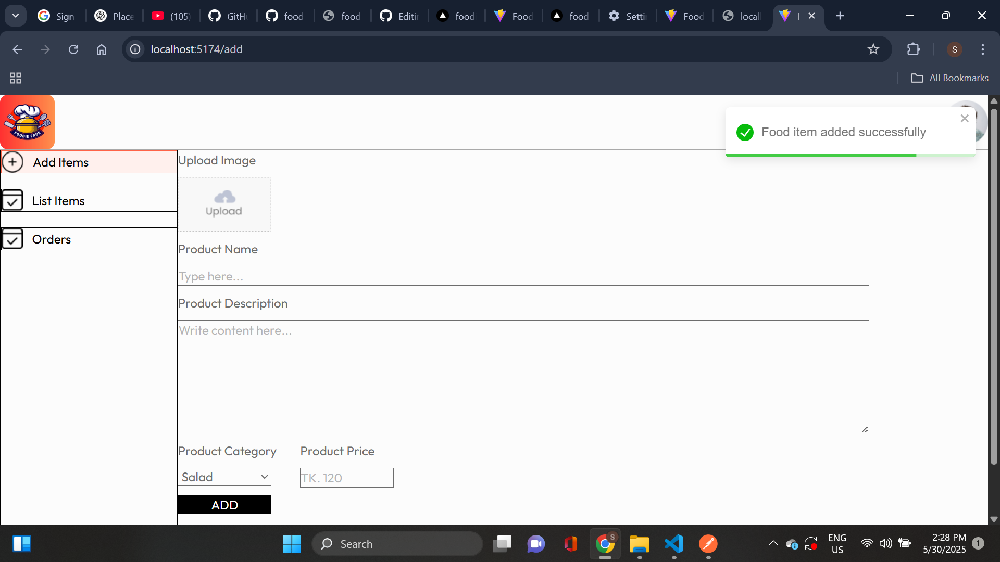
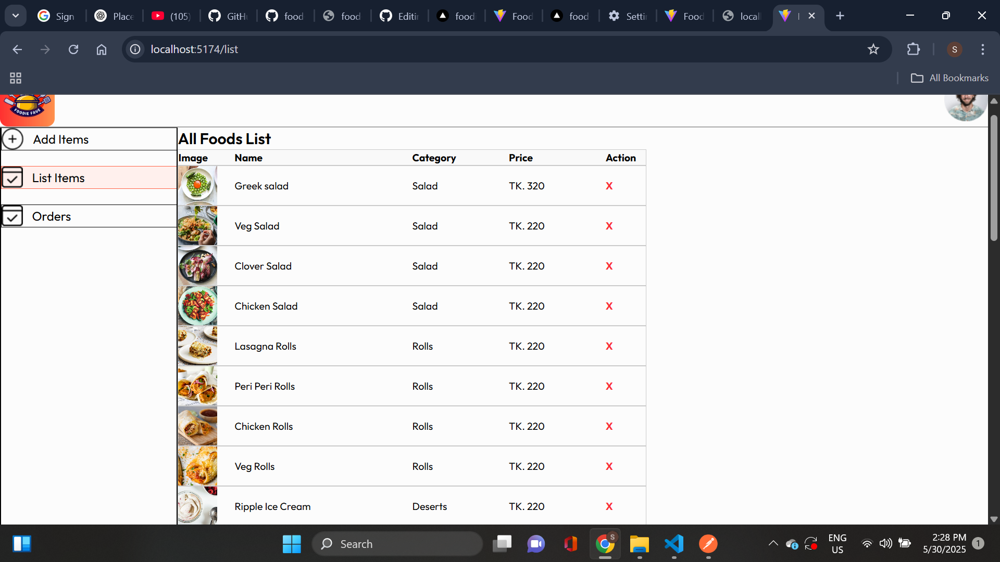
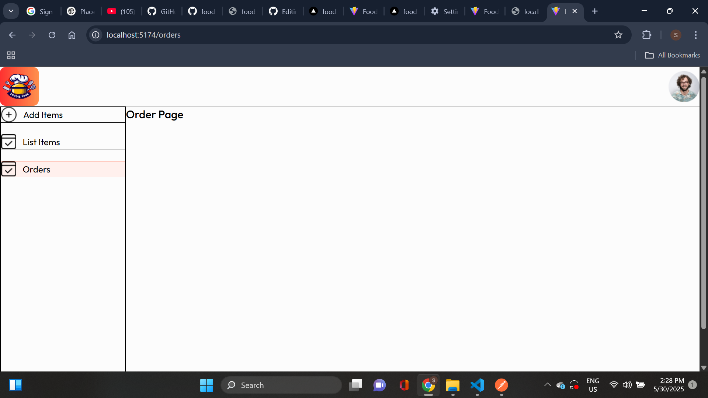

---

